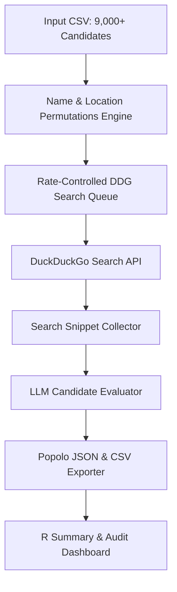

# Implementation Plan: PEP Social Media Discovery & Popolo Resolution System

System architecture to ingest 9,000+ South African Local Government Election Candidates, generate multi-permutation search queries across 7 social platforms, query DuckDuckGo with rate-limiting controls, evaluate search snippets using an LLM, and export populated Popolo JSON records.

## System Architecture

## Proposed Components

### 1. Data Schema & Models (`models.py`)
- Standard Popolo `Person`, `ContactDetail`, and `Link` schemas.
- Extended `ContactDetail` with `confidence` (0.0 to 1.0), `confidence_level` (`HIGH`, `MEDIUM`, `LOW`), `rationale`, and `signals`.

### 2. Multi-Permutation Query Engine (`query_builder.py`)
- Name order permutations: `First Last`, `First Middle Last`, `Middle Last`, `Last First`, `F. Last`, `First M. Last`.
- Location qualifier extraction: District (e.g. `Ugu`, `Matlosana`), Municipality, Ward, and `"South Africa"`.
- Platform site dorks:
  - Facebook: `site:facebook.com`
  - LinkedIn: `site:linkedin.com/in`
  - X: `site:x.com`
  - Instagram: `site:instagram.com`
  - TikTok: `site:tiktok.com`
  - Telegram: `site:t.me`
  - YouTube: `site:youtube.com`

### 3. Rate-Controlled DDG Search Queue (`search_engine.py`)
- Integrated pacing delays (1.5s - 2.0s per query) to respect DuckDuckGo limits.
- Exponential backoff retry logic on HTTP 429 rate limit events.
- Caching search query results to disk (`cache/search_cache.json`) to prevent duplicate queries across runs.

### 4. LLM Candidate Evaluator (`evaluator.py`)
- Multi-signal prompt evaluating candidate snippet against target metadata:
  - **Name Match**: Token overlap & phonetic match.
  - **Geography**: District, Ward, Municipality alignment.
  - **Bio & Context**: Campaign terms, office title, political context.
  - **Party Account Exclusion Filter**: Disqualifies official political party pages to focus on personal, professional, or candidate campaign accounts.
- Outputs structured evaluation payload with confidence score and explicit signals.

### 5. Ingestion Runner (`run_pipeline.py`)
- CLI runner with batching support (process in configurable batch sizes, e.g. 50 candidates per batch).
- Exports validated Popolo JSON (`popolo_candidates_out.json`) and flattened CSV summary.

### 6. R Analysis & Reporting Script (`scripts/audit_peps.R`)
- Reads generated Popolo dataset, unnested handles, confidence distributions, and platform coverage statistics.

## Verification Plan

### Automated Tests
1. Unit test `generate_comprehensive_name_permutations` against sample candidate names.
2. Run pipeline on a sample batch of 10 candidates from `/Users/arf/Downloads/PEP data _ South Africa _ Tables _ 2026 _ Local Gorvenment Election Candidates - persons.csv`.
3. Validate output JSON against Popolo schema definition.
